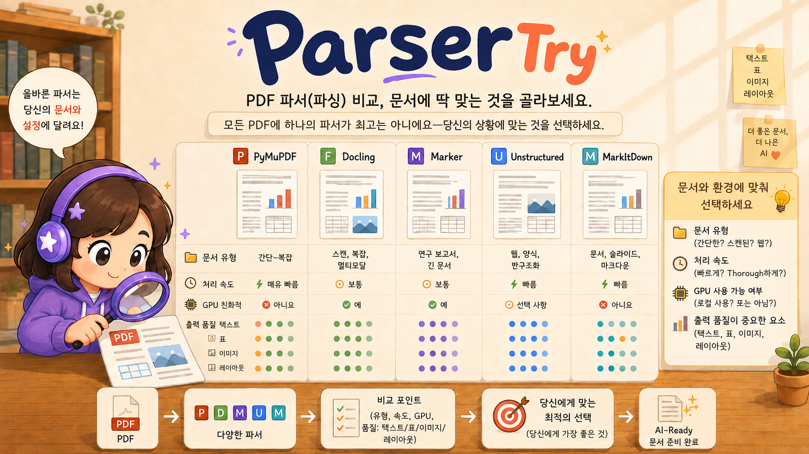

<div align="center">

# ParserTry

**PDF 파서 비교 · 21종+ 파서(계속 확장) · 즉시 실행 · 로컬 웹앱**

[](https://python.org)
[](https://fastapi.tiangolo.com)
[](LICENSE)

한국어 · **[English](README_Eng.md)**



</div>

---

## 개념

> **"올바른 파서는 당신의 문서와 설정에 달려 있습니다."**

모든 PDF에 하나의 파서가 최고가 아닙니다. ParserTry는 **현재 21종**의 PDF 파서를 웹 UI에서 즉시 실행·비교하여 **내 문서에 가장 잘 맞는 파서를 직접 확인**할 수 있는 도구입니다. 21종은 고정이 아니며, **새로운 파서를 계속 추가할 수 있는 확장형 구조**입니다.

- 연구자·개발자가 RAG 파이프라인 구축 전, 파서 선택 근거를 빠르게 검증
- 도커·복잡한 환경 구성 없이 `python run.py` 한 줄로 실행

---

## 📸 동작 화면

**1. 전체 화면 — 문서 뷰어 + 요소 추출**
PDF 위에 파서가 인식한 요소를 색상 박스로 오버레이하고, 우측에 좌표·타입·내용이 담긴 요소 목록을 함께 보여줍니다.


**2. 문서 뷰 동작 — Docling으로 논문 3페이지 파싱 → 마크다운 렌더링**
`1706.03762v7.pdf`(Attention Is All You Need) 3페이지를 Docling으로 분석해, 그림(Transformer 구조도)까지 포함한 마크다운으로 렌더링한 결과입니다.


**3. 파서 추천 — 문서 특성 자동 분석 + 적합도 순위**
문서의 텍스트 레이어·이미지·표·언어·레이아웃을 자동 분석하고, 파서별 적합도 점수와 추천 이유를 순위로 제시합니다.


**4. 파서 정보 — 실측 기반 분석 그래프 + 비교표**
샘플 문서 실측 결과로 그린 **품질 × 처리속도** 산점도(오른쪽 위일수록 빠르고 정확)와, 지원 파서(현재 21종, 계속 확장 가능)의 기능·실측 성공률을 담은 비교표입니다.


---

## 📊 파서 분석결과 (실측 데이터)

샘플문서 4종(논문·손글씨·잡지·한글계획서) 각 1페이지를 21종 파서로 직접 돌려 측정한 결과입니다. 가로축은 처리속도(오른쪽일수록 빠름), 세로축은 품질(레이아웃 인식+OCR 수준)입니다.


### 지원 파서 상세 비교표

| 파서 | 카테고리 | 품질 | 실측(1p) | 성공 | 텍스트 | 표 | OCR | 좌표 | GPU |
|---|---|---|---|---|---|---|---|---|---|
| [MinerU](https://github.com/opendatalab/MinerU) | 과학문헌 특화 | 88 | 11.5s | 4/4 | ✓ | ✓ | ✓ | ✓ | 선택 |
| [Docling](https://github.com/docling-project/docling) | 고급 문서 변환 | 86 | 4.0s | 4/4 | ✓ | ✓ | ✓ | ✓ | 선택 |
| [Claude Vision (Anthropic)](https://github.com/anthropics/anthropic-sdk-python) | VLM 기반 파서 | 85 | 46.7s | 4/4 | ✓ | ✓ | ✓ | ✓ | — |
| [GPT Vision (OpenAI)](https://github.com/openai/openai-python) | VLM 기반 파서 | 84 | 45.1s | 4/4 | ✓ | ✓ | ✓ | ✓ | — |
| [Marker](https://github.com/datalab-to/marker) | 고급 PDF → Markdown | 82 | 110.3s | 4/4 | ✓ | ✓ | · | ✓ | 선택 |
| [PaddleOCR](https://github.com/PaddlePaddle/PaddleOCR) | OCR/문서 구조 분석 | 76 | 248.9s | 4/4 | ✓ | ✓ | ✓ | ✓ | 선택 |
| [EasyOCR](https://github.com/JaidedAI/EasyOCR) | OCR 엔진 | 76 | 16.5s | 4/4 | ✓ | · | ✓ | ✓ | 선택 |
| [Unstructured](https://github.com/Unstructured-IO/unstructured) | 문서 ETL/RAG | 70 | 6.5s | 4/4 | ✓ | ✓ | · | ✓ | 선택 |
| [OCRmyPDF](https://github.com/ocrmypdf/OCRmyPDF) | OCR PDF 생성 | 66 | 7.3s | 4/4 | ✓ | · | ✓ | · | — |
| [pdfplumber](https://github.com/jsvine/pdfplumber) | PDF 좌표/표 추출 | 55 | 0.0s | 4/4 | ✓ | ✓ | · | ✓ | — |
| [PyMuPDF](https://github.com/pymupdf/pymupdf) | 기본 PDF 엔진 | 52 | 0.0s | 4/4 | ✓ | · | · | ✓ | — |
| [PyMuPDF4LLM](https://github.com/pymupdf/pymupdf4llm) | LLM/RAG용 변환 | 48 | 2.2s | 4/4 | ✓ | ✓ | · | · | — |
| [Ollama (로컬 VLM)](https://github.com/ollama/ollama) | VLM 기반 파서 | 48 | 73.5s | 4/4 | ✓ | ✓ | ✓ | ✓ | 선택 |
| [OpenDataLoader](https://github.com/opendataloader-project/opendataloader-pdf) | 고급 문서 변환 | 48 | 1.4s | 4/4 | ✓ | ✓ | · | ✓ | — |
| [pdfminer.six](https://github.com/pdfminer/pdfminer.six) | PDF 텍스트 추출 | 45 | 0.0s | 4/4 | ✓ | · | · | ✓ | — |
| [MarkItDown](https://github.com/microsoft/markitdown) | LLM용 경량 변환 | 40 | 0.0s | 4/4 | ✓ | ✓ | · | · | — |
| [pypdf](https://github.com/py-pdf/pypdf) | PDF 조작/간단 추출 | 32 | 0.0s | 4/4 | ✓ | · | · | · | — |
| [Camelot](https://github.com/camelot-dev/camelot) | 표 추출 특화 | 32 | 0.3s | 4/4 | ✓ | ✓ | · | ✓ | — |
| [tabula-py](https://github.com/chezou/tabula-py) | 표 추출 특화 | 26 | 2.6s | 4/4 | ✓ | ✓ | · | ✓ | — |
| [olmOCR](https://github.com/allenai/olmocr) | VLM 기반 PDF OCR | — | — | 0/4 | ✓ | ✓ | ✓ | · | 필수 |
| [Gemini Vision (Google)](https://github.com/google-gemini/generative-ai-python) | VLM 기반 파서 | — | — | 0/4 | ✓ | ✓ | ✓ | ✓ | — |

> **품질**: 측정값과 일반적 특성을 종합한 0~100 상대 지표. **실측(1p)**: 1페이지 평균 처리시간. **성공**: 샘플 4종 중 성공 수. **GPU**: 선택/필수. olmOCR(GPU 필요)·Gemini(API 키 미설정)는 미실행이라 품질·속도가 비어 있습니다. 측정 환경은 GPU 없이 CPU만 사용했으며, 문서 종류·설정·하드웨어에 따라 결과는 크게 달라질 수 있습니다.

---

## 주요 기능

### 📄 문서 뷰어 + 파서 결과 비교
- PDF 원본과 파싱 결과를 좌우로 나란히 비교
- **텍스트 · 마크다운 · 요소목록 · 레이아웃 · 미디어 · JSON** 6개 탭
- 오버레이: 파서가 인식한 요소의 위치를 PDF 위에 색상별로 표시
- PDF ↔ 결과 양방향 클릭 연동 (요소 카드 클릭 → PDF 해당 위치로 스크롤)
- 연속 스크롤 뷰어 + 높이맞춤 / 폭맞춤 줌

### 💡 파서 추천 분석
- PDF 특성을 자동 분석 (텍스트 레이어 유무, 이미지·표·수식·언어·컬럼 수)
- 각 파서의 **적합도 점수(0–100)** + 추천 이유 + 주의사항
- 빠른 분석 (<1초) / 심층 분석 (스캔 문서 샘플 OCR)
- 분석 방법·도구·신뢰도·한계를 투명하게 공개

### 🧩 파서 지원 — 현재 21종, 계속 확장 가능

| 카테고리 | 파서 |
|---|---|
| 텍스트 | PyMuPDF, PyMuPDF4LLM, pdfplumber, pdfminer.six, pypdf, MarkItDown |
| ML / 레이아웃 | Docling, Marker, MinerU, Unstructured, OpenDataLoader |
| 표 특화 | Camelot, tabula-py |
| OCR | PaddleOCR, OCRmyPDF, EasyOCR, olmOCR |
| VLM | OpenAI Vision, Claude Vision, Gemini Vision, Ollama |

> 파서 목록은 고정이 아닙니다 — 새로운 파서를 계속 추가할 수 있는 확장형 구조입니다.

### 🖼️ 미디어 추출
- 파싱 결과에서 그림 · 표 · 차트 · 수식을 PNG로 자동 추출
- 썸네일 그리드 + 팝업 뷰어

### 📐 레이아웃 미니맵
- 파서가 인식한 요소 위치를 SVG 미니맵으로 시각화
- 읽기 순서 번호 + 요소 타입별 색상

### ⚙️ 기타
- 파서별 상세 옵션 (총 153개 옵션, 공식문서 기반)
- GPU / CPU 장치 선택 (Docling, Marker, MinerU, PaddleOCR, EasyOCR, olmOCR)
- LLM Vision 파서: API 키 설정 + 모델 선택 UI
- 페이지 범위 선택 + 분석 중지
- 다국어 UI: 한국어 · English · 日本語 · 中文
- 다크 / 라이트 모드

---

## 🟢 가장 쉬운 설치 (누구나 · 터미널 불필요)

**1. 파이썬 설치** (최초 한 번) — <https://www.python.org/downloads/> 에서 받아 설치하세요.
&nbsp;&nbsp;👉 **윈도우**는 설치 첫 화면에서 **“Add Python to PATH”** 를 꼭 체크하세요.

**2. ParserTry 내려받기** — 이 페이지 위쪽 초록색 **`Code ▾`** → **Download ZIP** → 압축 풀기.

**3. 실행** — 압축 푼 폴더에서 내 운영체제에 맞는 파일을 **더블클릭**:

| 내 컴퓨터 | 더블클릭 |
|---|---|
| 🪟 윈도우 | **`start.bat`** |
| 🍎 맥(macOS) | **`start.command`** |
| 🐧 리눅스 | **`start.sh`** |

끝입니다. **첫 실행은 필요한 것들을 자동으로 설치**(몇 분 소요)한 뒤 브라우저가 **http://localhost:8080** 으로 열립니다. 다음부터는 같은 더블클릭으로 바로 시작됩니다.

> 맥에서 *“확인되지 않은 개발자”* 경고가 나오면 `start.command`를 **우클릭 → 열기 → 열기** (최초 1회만).

### 모든 파서 + OCR 도구까지 한 번에

```bash
python install.py --full
```

`--full` 은 무거운 파서(Docling·Marker·MinerU·PaddleOCR·EasyOCR·OCRmyPDF·Unstructured·Camelot·Tabula 등)와 이들이 쓰는 외부 도구(**tesseract·poppler·ghostscript·Java 11**)까지 운영체제 패키지 매니저로 자동 설치합니다. 설치하지 못한 항목은 건너뛰며, 앱은 그대로 실행되고 사용 불가 파서는 “미설치”로 표시됩니다.

<details><summary>터미널이 익숙하다면 (고급)</summary>

```bash
python3 install.py     # 또는 윈도우: py install.py
python3 run.py         # http://localhost:8080
```

자세한 내용은 **[INSTALL.md](INSTALL.md)** 참고. 클라우드 비전 파서(OpenAI·Claude·Gemini)는 앱의 **설정**에서 본인 API 키를 입력하면 켜집니다.
</details>

---

## 프로젝트 구조

```
DocParserView/
├── run.py                  # 실행 진입점
├── backend/
│   ├── main.py             # FastAPI 앱
│   ├── parsers/            # 21개 파서 모듈
│   ├── pdf_analyzer.py     # PDF 특성 분석 + 파서 추천
│   ├── media_extract.py    # 미디어 요소 추출
│   └── storage.py          # 파일 관리
└── frontend/
    ├── index.html          # Alpine.js + Tailwind UI
    ├── app.js              # 앱 로직
    └── styles.css
```

---


## 📞 문의
- 이용 (ryonglee@kisti.re.kr)

---

## 👨‍💻 개발자 그룹

KISTI **BLUESKY** 팀 — *Harmonizing Human and AI Collaboration* · [github.com/leeryong/KISTI_BLUESKY](https://github.com/leeryong/KISTI_BLUESKY)

- 이용 (ryonglee@kisti.re.kr)
- 장래영 (raezero@kisti.re.kr)
- 구자현 (jahyeongu@kisti.re.kr)
