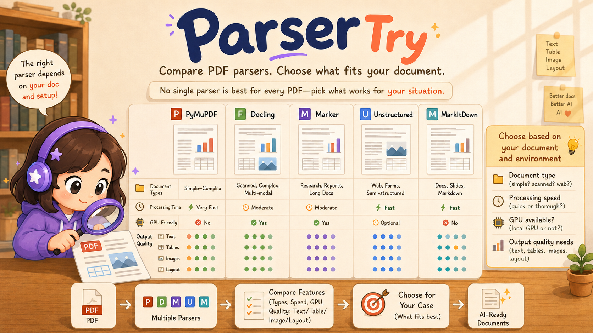
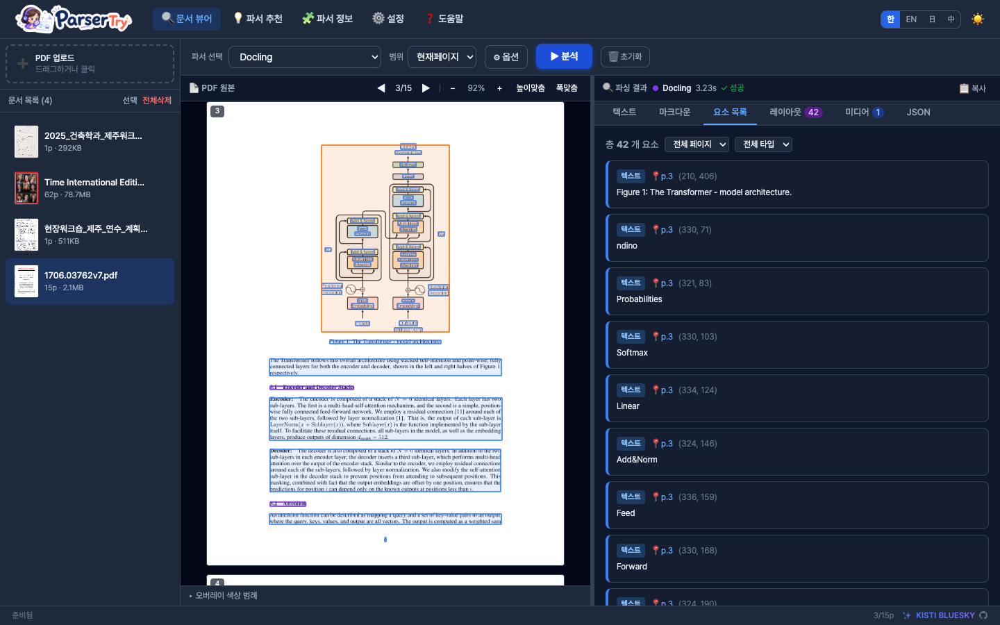
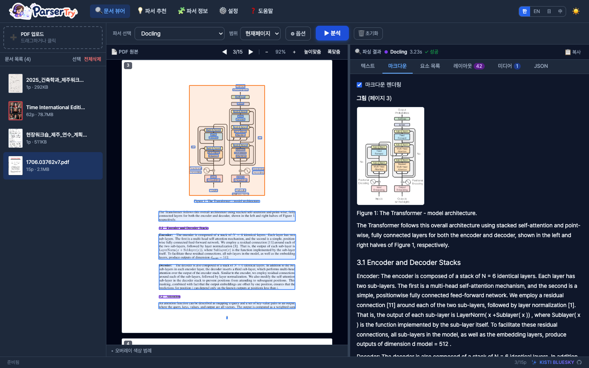
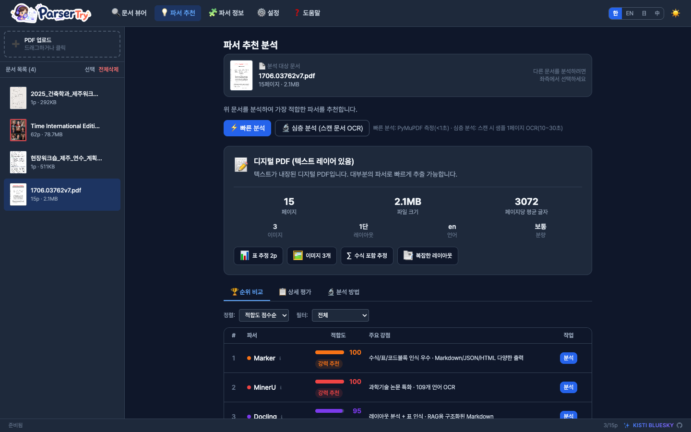
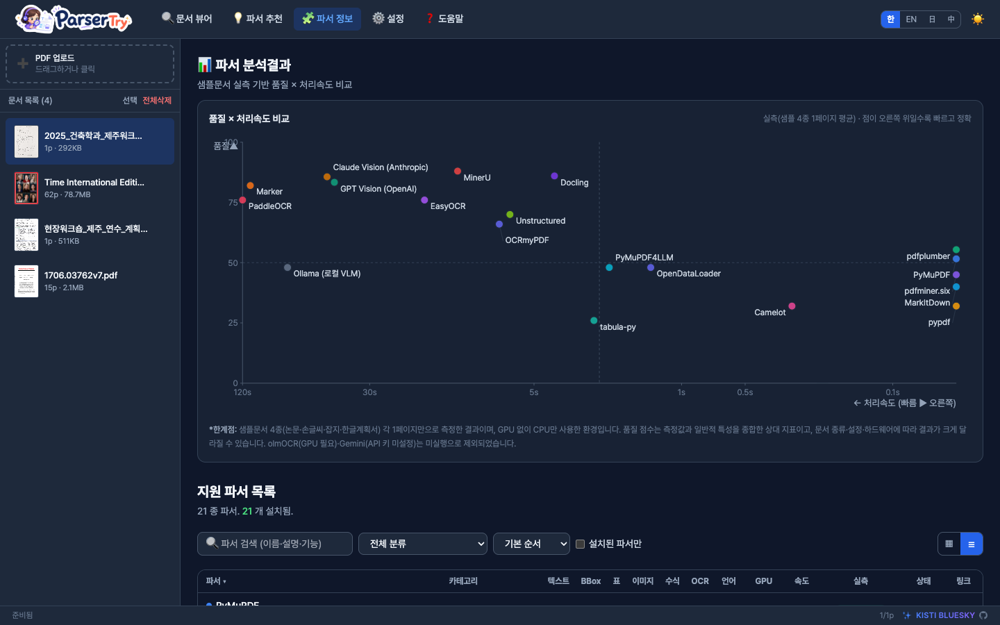
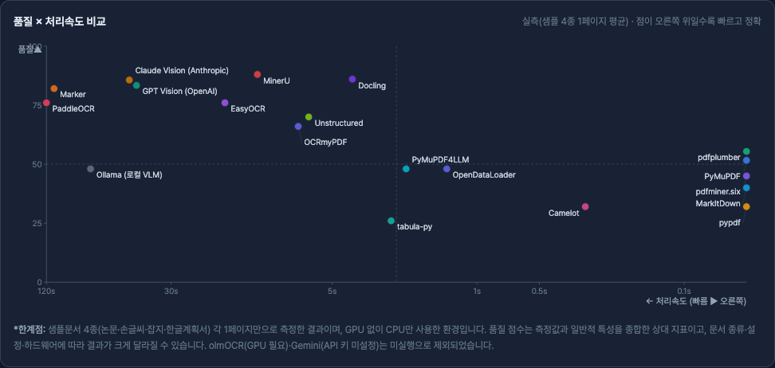

<div align="center">

# ParserTry

**PDF Parser Comparison · 21+ parsers (and growing) · instant run · local web app**

[](https://python.org)
[](https://fastapi.tiangolo.com)
[](LICENSE)

**English** · [한국어](README.md)



</div>

---

## 🆕 Latest News

> ### 📦 ${\color{red}\textsf{ParserTry distribution is out!}}$
>
> <b>June 23, 2026</b> — The ready-to-use **ParserTry distribution** is now public.
> On **Windows, macOS, or Linux**, with no preparation: unzip and **double-click** once —
> the first launch installs and starts everything automatically. Compare **21 PDF parsers**
> on the same document, side by side.
>
> ➡️ **[See the easiest install guide](#-easiest-install-for-everyone--no-terminal-needed)**

---

### Concept

> **"The right parser depends on your document and your setup."**

No single parser is best for every PDF. ParserTry lets you run **21 parsers (today)** instantly in a web UI and compare their outputs — so you can **see for yourself which parser fits your document best**. 21 is not a hard limit — it is built to keep adding new parsers.

- Researchers and developers can quickly validate parser choices before building RAG pipelines
- Runs with a single command — no Docker, no complex environment setup

---

### 📸 Screenshots

**1. Overview — Document viewer + element extraction**
Detected elements are overlaid as color boxes on the PDF, with an element list (coordinates, type, content) on the right.



**2. Document view in action — Docling parsing page 3 → Markdown rendering**
Page 3 of `1706.03762v7.pdf` (Attention Is All You Need) parsed by Docling and rendered as Markdown, including the figure (Transformer architecture).



**3. Parser recommendation — auto document analysis + suitability ranking**
The document's text layer, images, tables, language and layout are analyzed automatically, then parsers are ranked by suitability score with reasons.



**4. Parser info — measurement-based analysis chart + comparison table**
A **quality × speed** scatter chart from real measurements on sample documents (top-right = faster and more accurate), plus a comparison table of the supported parsers (21 today, and growing) — features and measured success rates.



---

### 📊 Parser Analysis (measured)

Results from actually running all 21 parsers on one page each of 4 sample documents (paper, handwriting, magazine, Korean plan). X-axis = processing speed (faster to the right), Y-axis = quality (layout recognition + OCR level).



#### Supported parsers — detailed comparison

| Parser | Category | Quality | Speed (1p) | Success | Text | Table | OCR | BBox | GPU |
|---|---|---|---|---|---|---|---|---|---|
| [MinerU](https://github.com/opendatalab/MinerU) | Scientific papers | 88 | 11.5s | 4/4 | ✓ | ✓ | ✓ | ✓ | opt |
| [Docling](https://github.com/docling-project/docling) | Advanced document conversion | 86 | 4.0s | 4/4 | ✓ | ✓ | ✓ | ✓ | opt |
| [Claude Vision (Anthropic)](https://github.com/anthropics/anthropic-sdk-python) | VLM-based parser | 85 | 46.7s | 4/4 | ✓ | ✓ | ✓ | ✓ | – |
| [GPT Vision (OpenAI)](https://github.com/openai/openai-python) | VLM-based parser | 84 | 45.1s | 4/4 | ✓ | ✓ | ✓ | ✓ | – |
| [Marker](https://github.com/datalab-to/marker) | Advanced PDF → Markdown | 82 | 110.3s | 4/4 | ✓ | ✓ | · | ✓ | opt |
| [PaddleOCR](https://github.com/PaddlePaddle/PaddleOCR) | OCR / structure analysis | 76 | 248.9s | 4/4 | ✓ | ✓ | ✓ | ✓ | opt |
| [EasyOCR](https://github.com/JaidedAI/EasyOCR) | OCR engine | 76 | 16.5s | 4/4 | ✓ | · | ✓ | ✓ | opt |
| [Unstructured](https://github.com/Unstructured-IO/unstructured) | Document ETL/RAG | 70 | 6.5s | 4/4 | ✓ | ✓ | · | ✓ | opt |
| [OCRmyPDF](https://github.com/ocrmypdf/OCRmyPDF) | OCR PDF generation | 66 | 7.3s | 4/4 | ✓ | · | ✓ | · | – |
| [pdfplumber](https://github.com/jsvine/pdfplumber) | PDF coordinates / tables | 55 | 0.0s | 4/4 | ✓ | ✓ | · | ✓ | – |
| [PyMuPDF](https://github.com/pymupdf/pymupdf) | Core PDF engine | 52 | 0.0s | 4/4 | ✓ | · | · | ✓ | – |
| [PyMuPDF4LLM](https://github.com/pymupdf/pymupdf4llm) | LLM/RAG conversion | 48 | 2.2s | 4/4 | ✓ | ✓ | · | · | – |
| [Ollama (로컬 VLM)](https://github.com/ollama/ollama) | VLM-based parser | 48 | 73.5s | 4/4 | ✓ | ✓ | ✓ | ✓ | opt |
| [OpenDataLoader](https://github.com/opendataloader-project/opendataloader-pdf) | Advanced document conversion | 48 | 1.4s | 4/4 | ✓ | ✓ | · | ✓ | – |
| [pdfminer.six](https://github.com/pdfminer/pdfminer.six) | PDF text extraction | 45 | 0.0s | 4/4 | ✓ | · | · | ✓ | – |
| [MarkItDown](https://github.com/microsoft/markitdown) | Lightweight LLM conversion | 40 | 0.0s | 4/4 | ✓ | ✓ | · | · | – |
| [pypdf](https://github.com/py-pdf/pypdf) | PDF manipulation / quick extract | 32 | 0.0s | 4/4 | ✓ | · | · | · | – |
| [Camelot](https://github.com/camelot-dev/camelot) | Table extraction | 32 | 0.3s | 4/4 | ✓ | ✓ | · | ✓ | – |
| [tabula-py](https://github.com/chezou/tabula-py) | Table extraction | 26 | 2.6s | 4/4 | ✓ | ✓ | · | ✓ | – |
| [olmOCR](https://github.com/allenai/olmocr) | VLM-based PDF OCR | — | — | 0/4 | ✓ | ✓ | ✓ | · | req |
| [Gemini Vision (Google)](https://github.com/google-gemini/generative-ai-python) | VLM-based parser | — | — | 0/4 | ✓ | ✓ | ✓ | ✓ | – |

> **Quality**: a 0–100 relative score combining measurements and general capability. **Speed (1p)**: average time per page. **Success**: succeeded out of 4 samples. **GPU**: opt/req. olmOCR (needs GPU) and Gemini (no API key) did not run, so their quality/speed are blank. Measured on CPU only — results vary greatly with document type, settings and hardware.

---

### Key Features

#### 📄 Document Viewer + Parser Result Comparison
- Compare the original PDF and parser output side by side
- **6 result tabs**: Text · Markdown · Elements · Layout · Media · JSON
- Overlay: visualize detected element positions on the PDF, color-coded by type
- Two-way click sync: click an element card → scroll PDF to that location
- Continuous scroll viewer + fit-to-height / fit-to-width zoom

#### 💡 Parser Recommendation
- Automatically analyzes PDF characteristics (text layer, images, tables, formulas, language, column count)
- **Suitability score (0–100)** per parser + reasons + caveats
- Quick analysis (<1 sec) / Deep analysis (sample OCR for scanned documents)
- Transparent reporting of analysis methods, tools, confidence levels, and limitations

#### 🧩 Supported Parsers — 21 today, easily extensible

| Category | Parsers |
|---|---|
| Text | PyMuPDF, PyMuPDF4LLM, pdfplumber, pdfminer.six, pypdf, MarkItDown |
| ML / Layout | Docling, Marker, MinerU, Unstructured, OpenDataLoader |
| Tables | Camelot, tabula-py |
| OCR | PaddleOCR, OCRmyPDF, EasyOCR, olmOCR |
| VLM | OpenAI Vision, Claude Vision, Gemini Vision, Ollama |

> This list is not fixed — ParserTry is built to keep adding new parsers.

#### 🖼️ Media Extraction
- Automatically crops images, tables, charts, and formulas from PDF pages as PNG
- Thumbnail grid + popup viewer

#### 📐 Layout Minimap
- SVG visualization of detected element positions
- Reading order numbers + color-coded by element type

#### ⚙️ Other
- Per-parser detailed options (153 options total, based on official documentation)
- GPU / CPU device selection (Docling, Marker, MinerU, PaddleOCR, EasyOCR, olmOCR)
- LLM Vision parsers: API key configuration + model selection UI
- Page range selection + cancel analysis mid-run
- Multilingual UI: Korean · English · Japanese · Chinese
- Dark / Light mode

---

## 🟢 Easiest install (for everyone — no terminal needed)

**1. Install Python** (one time) — get it from <https://www.python.org/downloads/> and run the installer.
&nbsp;&nbsp;👉 On **Windows**, tick **“Add Python to PATH”** on the first screen.

**2. Download ParserTry** — click the green **`Code ▾`** button at the top of this page → **Download ZIP**, then unzip.

**3. Start it** — open the unzipped folder and **double-click** your launcher:

| Your computer | Double-click |
|---|---|
| 🪟 Windows | **`start.bat`** |
| 🍎 macOS | **`start.command`** |
| 🐧 Linux | **`start.sh`** |

That's it. The first launch sets everything up automatically (a few minutes), then
your browser opens at **http://localhost:8080**. Next time, the same double-click
starts it instantly.

> macOS may say *“cannot be opened because it is from an unidentified developer.”*
> Right-click `start.command` → **Open** → **Open** (only needed once).

### Everything (all parsers + OCR tools)

```bash
python install.py --full
```

`--full` also installs the heavy parsers (Docling, Marker, MinerU, PaddleOCR,
EasyOCR, OCRmyPDF, Unstructured, Camelot, Tabula) and the external tools they need
(**tesseract, poppler, ghostscript, Java 11**) via your system package manager.
Anything that can't be installed is skipped; the app still runs and marks
unavailable parsers as "not installed".

<details><summary>Prefer the terminal? (advanced)</summary>

```bash
python3 install.py     # or: py install.py   (Windows)
python3 run.py         # http://localhost:8080
```

See **[INSTALL.md](INSTALL.md)** for details. Cloud vision parsers (OpenAI / Claude
/ Gemini) turn on once you add your own API key in the app's **Settings**.
</details>

---

### Project Structure

```
DocParserView/
├── run.py                  # Entry point
├── backend/
│   ├── main.py             # FastAPI app
│   ├── parsers/            # 21 parser modules
│   ├── pdf_analyzer.py     # PDF analysis + parser recommendation
│   ├── media_extract.py    # Media element extraction
│   └── storage.py          # File management
└── frontend/
    ├── index.html          # Alpine.js + Tailwind UI
    ├── app.js              # App logic
    └── styles.css
```

---


## 📞 Contact
- Ryong Lee (ryonglee@kisti.re.kr)

---

## 👨‍💻 Developer Group

KISTI **BLUESKY** Team — *Harmonizing Human and AI Collaboration* · [github.com/leeryong/KISTI_BLUESKY](https://github.com/leeryong/KISTI_BLUESKY)

- Ryong Lee (ryonglee@kisti.re.kr)
- Raeyoung Jang (raezero@kisti.re.kr)
- Jahyeon Gu (jahyeongu@kisti.re.kr)
